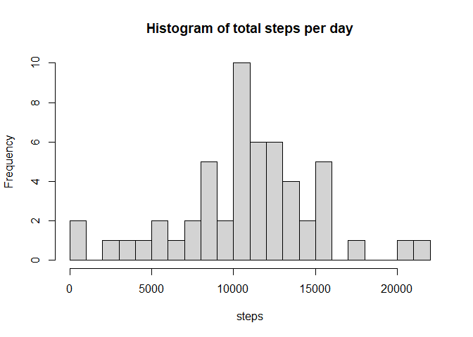
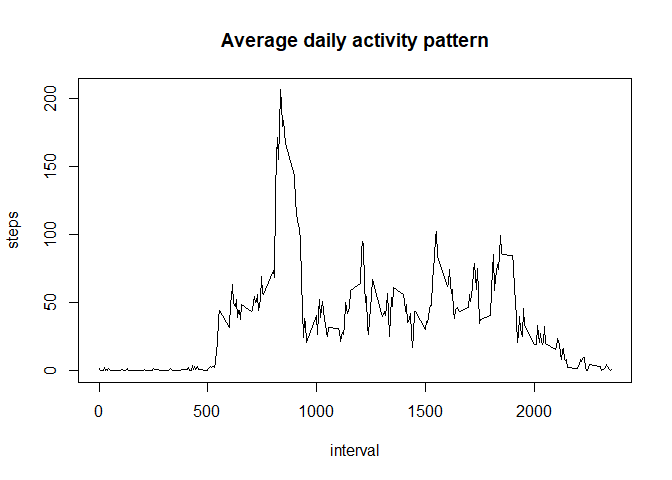
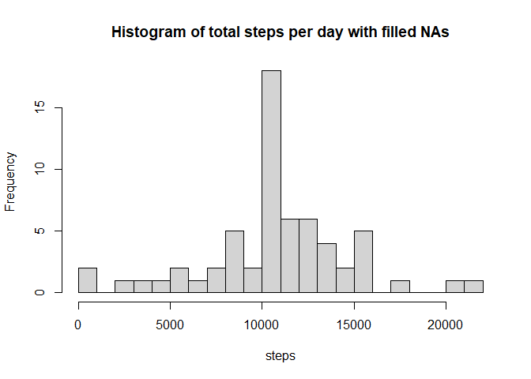
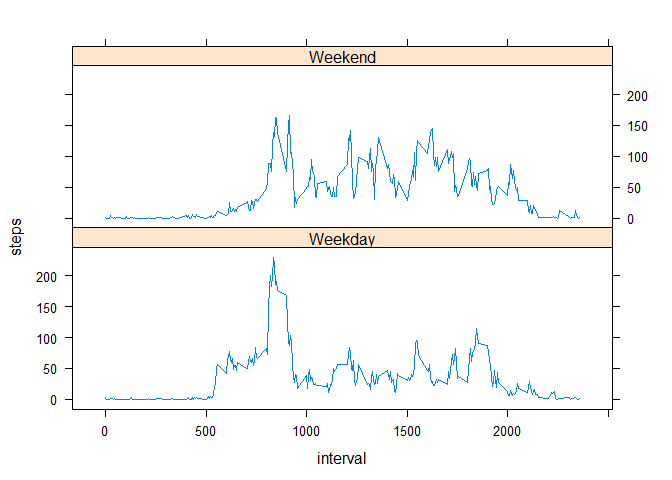

## Loading and preprocessing the data

```r
library(dplyr)
library(lattice)
Sys.setlocale(locale="English") #Setting English for proper weekday factors
unzip("activity.zip")
read.csv("activity.csv", header=TRUE, na.strings = "NA") %>%
mutate(date=as.Date(date)) -> stepsdata
```


## What is mean total number of steps taken per day?

```r
aggregate(steps~date, stepsdata, sum) %>%
with({ 
    hist(steps, breaks=20, main="Histogram of total steps per day")
    print("Mean number of steps per day is:")
    print(mean(steps))
    print("Median number of steps per day is:")
    print(median(steps))
    })
```

<!-- -->

```
## [1] "Mean number of steps per day is:"
## [1] 10766.19
## [1] "Median number of steps per day is:"
## [1] 10765
```


## What is the average daily activity pattern?

```r
aggregate(steps~interval,stepsdata,mean) %>%
with({
    plot(interval, steps, type="l", main="Average daily activity pattern")
    print("Maximum average number of steps per day is:")
    print(max(steps))
    print("Interval with maximum average number of steps is:")
    print(interval[which.max(steps)])
    })
```

<!-- -->

```
## [1] "Maximum average number of steps per day is:"
## [1] 206.1698
## [1] "Interval with maximum average number of steps is:"
## [1] 835
```

## Imputing missing values

```r
{print("Calculating number of NAs in dataset:")
print(sum(is.na(stepsdata$steps)))}
```

```
## [1] "Calculating number of NAs in dataset:"
## [1] 2304
```

```r
#Filling NA values with average from each interval, rounded to integer
aggregate(steps~interval,stepsdata,mean) %>%                       #calculating means by intervals
mutate(fillNas=round(steps), steps=NULL) %>%                       #creating additional column "fillNas"
merge(stepsdata, by ="interval")         %>%                       #merging datasets by interval
mutate(steps=replace(steps,is.na(steps), fillNas[is.na(steps)]),   #replacing NA values with "fillNas"
       fillNas=NULL) %>%                                           #deleting additional column
arrange(date,interval) ->fillNAdata                                #sorting output and assigning to fillNAdata
#Creating histogram of total steps per day with filled NAs
aggregate(steps~date, fillNAdata, sum)   %>%
with({ 
  hist(steps, breaks=20, main="Histogram of total steps per day with filled NAs")
  print("Mean number of steps per day is:")
  print(mean(steps))
  print("Median number of steps per day is:")
  print(median(steps))
})
```

<!-- -->

```
## [1] "Mean number of steps per day is:"
## [1] 10765.64
## [1] "Median number of steps per day is:"
## [1] 10762
```
Histogram with filled NA values from rounded interval means differs from histogram with missed NAs. Adding missed values this way gives us enhanced peak in 11000 steps region and other regions are almost unchanged. We can conclude, that most of NAs were in "active" time interval, and we need to examine what usually causes missing measurements (this may be movement in transport or something like this) to assign missing values appropriately. Mean and median have not changed significantly.

## Are there differences in activity patterns between weekdays and weekends?

```r
fillNAdata %>%
mutate(Weekday=weekdays(date,abbreviate=TRUE),
      DayType=factor(Weekday,
      levels=c("Mon", "Tue", "Wed", "Thu", "Fri","Sat", "Sun"),
      labels=c(rep("Weekday", 5), rep("Weekend",2)))) %>%
group_by(DayType, interval)  %>%
summarize(steps=mean(steps)) %>%
with({
    xyplot(steps~interval|DayType, type="l", layout=c(1,2))
    })
```

<!-- -->
  
On this plot we can see, that average daily activity pattern on weekdays have higher peak near time 8:35, and on weekends activity pattern is more smoothed
